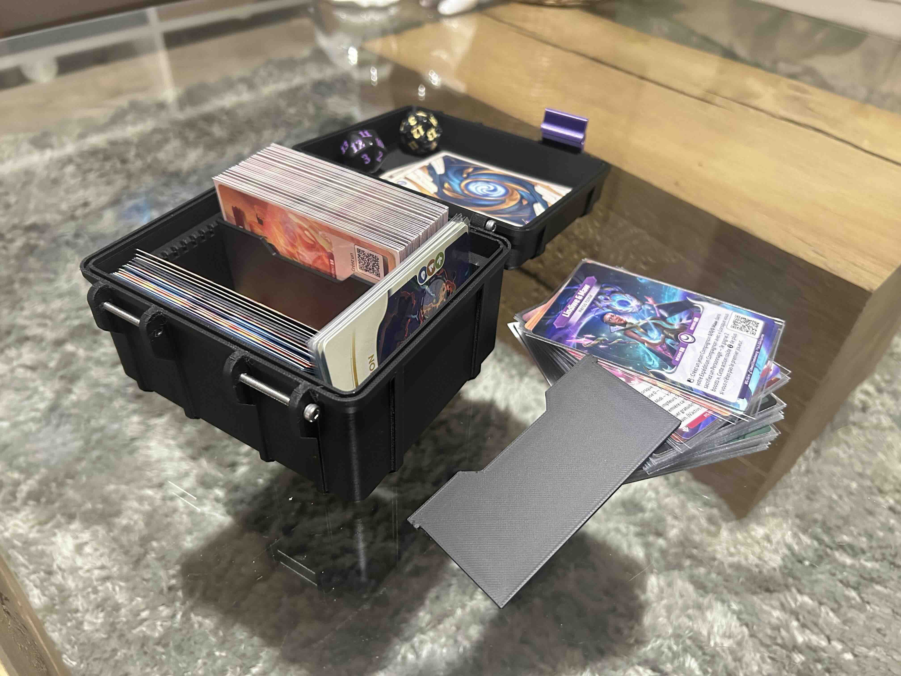

# Altered Deckbox - Rugged with modular spacers

This project provides a 3D-printable storage box designed specifically for the **Altered** card game. My goal is to offer a practical and stylish solution for storing and transporting your cards safely.  

- Remix based on this parametric rugged box by Whity
- Remix based on this parametric rugged box by Rubiksensei

Rubiksensei did a great job with his design, but I wanted to adapt it for the Altered TCG. For me, having a dedicated compartment to store the game's base cards was essential.

I also aimed to create a modular divider system in my design. I wasn’t a fan of Rubiksensei’s non-fixed divider—since my deck box is larger than his model, an incomplete deck could cause the cards to slide and lay flat at the bottom. To prevent this, my dividers are clip-on; once in place, they keep the cards securely positioned in their slots.

With this model you easily store 2 full deck of double sleeved altered card (80 cards) or 3 decks of single sleeved cards (120 cards) with a little stack of token cards and base expeditions cards on the right part of the deck box with the necessary separators.

## 📌 Features:  
- **Optimized design**: Perfectly sized for *Altered* cards, with enough space for sleeved cards.  
- **Easy printing**: Designed for support-free printing with good bed adhesion.  
- **Modular structure**: Can be adjusted in size or include dividers as needed.  
- **Ergonomic design**: A snug-fitting lid to prevent accidental openings.  

## 🔩 Hardware :
6 screws (M3×30) and optionally a piece of TPU filament in the main part groove (may need a bit of glue to keep it in place)

## 🎨 Customization:  
The model can be modified to fit your preferences (engraved designs, logos, etc.). Feel free to share your prints and improvements!  

## 📥 Download & Printing:  
The STL file is available on [MakerWorld](https://makerworld.com/en/models/965048#profileId-935417).  
Recommended print settings:  
- **Material**: PLA / PETG  
- **Layer height**: 0.2 mm  
- **Infill**: 15-20% gyroid
- **Supports**: Not required  

## 💡 Contributions:  
Any feedback or improvements are welcome! You can open an *issue* or submit a *pull request* on this repository.  