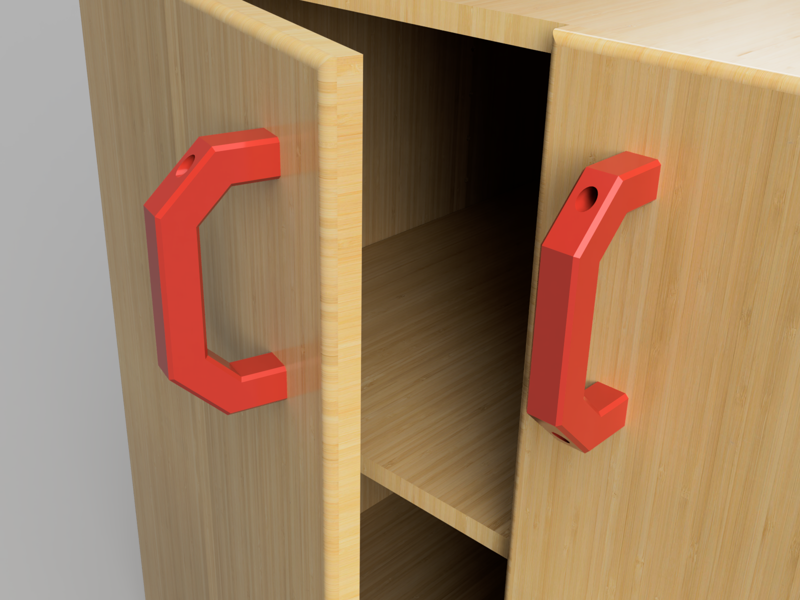

# Customizable Handle (OpenSCAD)

This project provides a **3D-printable parametric handle**, designed in **OpenSCAD**, allowing full customization to fit various needs. Whether you need a replacement handle or a custom grip, this design can be easily adjusted to match your requirements.  

## 📌 Features:  
- **Fully customizable**: Adjust dimensions such as length, diameter, grip shape, and hole size.  
- **Parametric design**: Modify values in OpenSCAD to generate a handle that perfectly fits your use case.  
- **Easy printing**: Designed for support-free printing with good adhesion.  
- **Versatile use**: Suitable for tool handles, drawer pulls, or any other grip-based applications.  

## 🎨 Customization:  
The OpenSCAD file allows for easy modifications. You can tweak parameters to change the handle’s size, shape, or mounting hole dimensions. Modifications can also be made in makerworld.

## 📥 Download & Printing:  
The STL file and OpenSCAD source code are available on:  
- **MakerWorld**: [Download here](https://makerworld.com/en/models/919765#profileId-881704)  
- **GitHub**: Clone this repository to modify the OpenSCAD file.  

### Recommended print settings:  
- **Material**: PLA / PETG / ABS  
- **Layer height**: 0.2 mm  
- **Infill**: 20-30% (higher for more strength)  
- **Supports**: Not required  

## 💡 Contributions:  
Any feedback or improvements are welcome! Feel free to open an *issue* or submit a *pull request* to enhance the project.  